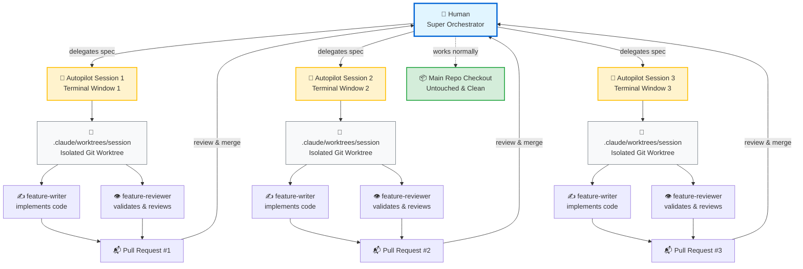

# agents-and-skills

List of Agents and Skills I have been working with

Design doc to working code. Give it a design document and it will decompose it into feature specs, generate repo validation context, implement every feature autonomously using a write-review agent loop, and open a final PR for your review.

**What you get at the end:** a single PR consolidating all implemented features, ready for your review and merge.

---

## Prerequisites

- [Claude Code](https://docs.anthropic.com/en/docs/claude-code) installed
- `git` and `gh` CLI installed and authenticated
- A GitHub repo with push access

---

## Installation

In any Claude Code session:

```sh
/plugin install autopilot-workflow
```

---

## How it works

The plugin runs a three-step pipeline:

```
Init Repo → Design Doc → Feature Specs → Implemented PRs
```

1. **`/autopilot-workflow:init`** — one-command setup: discovers validation commands, writes CLAUDE.md, creates roadmap folders, extracts agent context files, and configures settings.json
2. **`/autopilot-workflow:design-doc-decomposer`** — reads your design doc and proposes a breakdown of implementable feature slices for your approval, then generates one feature doc per slice
3. **`/autopilot-workflow:implementation-orchestrator`** — implements every feature spec one by one using a writer+reviewer agent loop, merging each into an integration branch, then opens a final PR

---

## Why "Autopilot"?

This plugin is designed for **autonomous, hands-off implementation**. Once you hand off a feature spec, bug ticket, or design doc to the workflow, Claude takes over — planning, implementing, validating, reviewing, and opening PRs — without requiring human intervention at each step.

The name reflects the core philosophy: **delegate and walk away**. You set the destination (the spec), Claude flies the plane.

### The Round-Robin Workflow

The most efficient way to use autopilot-workflow is **parallel delegation**:

1. **Delegate** — Hand off a task (design doc, feature, or bug) to Claude in one terminal session
2. **Switch context** — Open a new terminal window and start another autopilot session on a different task
3. **Let them run** — Both Claude sessions work in parallel, each in isolated git worktrees
4. **Review when done** — Come back when PRs are ready for your review

This round-robin pattern maximizes throughput: while one AI is implementing, you're either delegating another task or reviewing completed work. No waiting, no context switching during implementation.

### Git Worktrees: Isolation by Design

Each autopilot session works in a **dedicated git worktree** at `.claude/worktrees/session/`. This is a complete, isolated working copy of your repo that:

- Shares git history and objects with the main repo (space-efficient)
- Has its own checked-out branch and working directory
- Never touches your main checkout — you can keep working there while the agent runs
- Gets cleaned up automatically when the session completes

This isolation means:

- **Safe parallelism** — multiple autopilot sessions can run simultaneously without conflicts
- **No interruptions** — the main repo checkout stays clean for your own work
- **Easy cancellation** — if something goes wrong, just kill the session; your main checkout is untouched

### Architecture Overview



**Key:**

- **Human** delegates tasks and reviews final PRs — no micro-management during implementation
- **Autopilot Sessions** run independently in separate terminal windows
- **Worktrees** provide isolated environments — no conflicts between parallel sessions
- **Sub-agents** (writer + reviewer) collaborate in a tight loop until validation passes
- **Main Repo** stays clean — you can continue your own work uninterrupted

---

## Workflows

### Full Design Doc Implementation

**Use case:** You have a complete design doc (RFC, ADR, technical proposal) and want the entire system implemented autonomously.

**Steps:**

1. `/autopilot-workflow:design-doc-decomposer` — breaks the doc into feature slices, you review and approve the breakdown
2. `/autopilot-workflow:init` — sets up the repo with validation context
3. `/autopilot-workflow:implementation-orchestrator` in **features mode** — implements every feature, one by one, into an integration branch
4. Final PR opened for your review — merge when satisfied

**Time investment:** 30 minutes upfront (design doc + decomposition approval), then walk away for 1–3 hours while Claude implements.

**Best for:** New packages, large refactors, multi-component systems.

---

### Single Feature Implementation

**Use case:** You have one focused feature idea and want it implemented without writing a full design doc.

**Steps:**

1. `/autopilot-workflow:feature-doc-creator` — describe the feature in conversation, Claude explores the repo and writes a complete feature spec
2. `/autopilot-workflow:init` (if not already done) — sets up validation context
3. `/autopilot-workflow:implementation-orchestrator` in **features mode** — implements the single feature
4. PR opened for your review

**Time investment:** 15 minutes (feature description + spec review), then 20–60 minutes autonomous implementation.

**Best for:** Isolated features, integrations, CLI additions, tooling improvements.

---

### Single Bug Fix

**Use case:** You found a bug (from testing, user report, or production incident) and want it diagnosed and fixed.

**Steps:**

1. `/autopilot-workflow:bug-creator` — paste the error or describe the bug, Claude explores the repo, identifies the root cause, and writes a bug spec
2. `/autopilot-workflow:init` (if not already done)
3. `/autopilot-workflow:implementation-orchestrator` in **bugs mode** — fixes the bug and opens a PR directly to main
4. PR opened for your review

**Time investment:** 10 minutes (bug description + spec review), then 15–45 minutes autonomous fix.

**Best for:** Post-implementation cleanup, production hotfixes, issues discovered in review.

---

## Step-by-step guide

### Step 1 — Write your design doc

Place your design doc anywhere in the repo. A good location:

```
.claude/context/design-doc/DESIGN_DOC.md
```

The design doc should describe goals, architecture, package structure, and non-goals. See [Writing a good design doc](#writing-a-good-design-doc) below.

---

### Step 2 — Decompose the design doc into feature specs

```sh
/design-doc-decomposer decompose .claude/context/design-doc/DESIGN_DOC.md
```

With an optional reference repo (a similar codebase to draw patterns from):

```sh
/design-doc-decomposer decompose .claude/context/design-doc/DESIGN_DOC.md. Use /path/to/reference-repo as reference.
```

The skill will:

- Read and analyse the design doc
- Propose a numbered breakdown of feature slices (e.g. `01-s3-infrastructure`, `02-package-structure`, ...)
- **Pause and show you the breakdown for approval** — you can merge, split, reorder, or remove items
- Once approved, generate one `.md` spec file per feature into `.claude/context/roadmap/features/`

**Review the proposed breakdown carefully.** This is the most important decision point — the quality of the decomposition directly affects how well the implementation goes.

Example output after approval:

```
✅ 1/7: 01-s3-terraform-infrastructure.md
✅ 2/7: 02-package-structure-and-dependencies.md
✅ 3/7: 03-email-export-pipeline.md
...
```

---

### Step 3 — Initialize the repo

```sh
/autopilot-workflow:init
```

This one command:

- Inspects the repo to discover validation commands (package.json scripts, Makefile, CI config, etc.)
- Writes or updates `CLAUDE.md` with discovered commands and conventions
- Creates `.claude/context/roadmap/features/` and `.claude/context/roadmap/bugs/` directories
- Updates `.gitignore` to exclude roadmap directories
- Extracts agent-consumable files: `.claude/context/workflow.md` and `.claude/context/testing-checklist.md`
- Updates `.claude/settings.json` with allowed tools and paths

**Review `CLAUDE.md` after it is written.** Add any missing commands or checklist items before proceeding — these are the hard gates agents use before every commit.

---

### Step 4 — Run the implementation orchestrator

```sh
/implementation-orchestrator implement features
```

You will be asked for:

- **Mode**: `features`
- **Integration branch**: e.g. `feature/my-feature-name`

The orchestrator will:

1. Run pre-flight checks (dirty state, stale worktrees) and show you an execution plan
2. **Wait for your explicit go-ahead** before starting
3. For each feature spec, in order:
   - Create a feature branch in an isolated git worktree
   - Spawn a **feature-writer** agent to implement it
   - Spawn a **feature-reviewer** agent to verify it (runs validation commands + reviews the diff against the spec)
   - On `PASS`: merge the PR into the integration branch, move to next feature
   - On `FAIL`: send feedback back to the writer and retry (up to 3 times)
4. Open a final PR from the integration branch to `main` for your review

Sit back. The full run takes 1–2 hours depending on the number of features and repo size.

Example final output:

```
🎉 Roadmap Execution Complete

✅ 01-s3-terraform-infrastructure    → PR #21 merged → feature/react-email-system
✅ 02-package-structure              → PR #22 merged → feature/react-email-system
✅ 03-email-export-pipeline          → PR #23 merged → feature/react-email-system
✅ 04-preview-server-dev-tooling     → PR #24 merged → feature/react-email-system
✅ 05-liquid-syntax-validation       → PR #25 merged → feature/react-email-system
✅ 06-ci-cd-pipeline                 → PR #26 merged → feature/react-email-system
✅ 07-migrate-existing-templates     → PR #27 merged → feature/react-email-system

Completed: 7 / Failed: 0

Final PR for your review:
PR #28 → https://github.com/your-org/your-repo/pull/28
```

---

### Step 5 — Fix bugs

The agents are good but not perfect. Test the implementation, identify issues, and create bug tickets:

```sh
/bug-creator there is a bug: <paste error or description>
```

This creates a structured bug spec in `.claude/context/roadmap/bugs/`. Then run the orchestrator in bugs mode to fix them:

```sh
/implementation-orchestrator fix bugs
```

---

## Quick reference

| Step | Command                                                                               | What it does                                                        |
| ---- | ------------------------------------------------------------------------------------- | ------------------------------------------------------------------- |
| 1    | Write design doc                                                                      | Place at `.claude/context/design-doc/DESIGN_DOC.md`                 |
| 2    | `/autopilot-workflow:design-doc-decomposer`                                           | Propose + generate feature specs                                    |
| 3    | `/autopilot-workflow:init`                                                            | Initialize repo: discover commands, create folders, extract context |
| 4    | `/autopilot-workflow:implementation-orchestrator`                                     | Implement all features, open final PR                               |
| 5    | `/autopilot-workflow:bug-creator` + `/autopilot-workflow:implementation-orchestrator` | Fix bugs found in review                                            |

---

## Writing a good design doc

The design doc is the primary input. The better it is, the better the output.

**Include:**

- Goals and non-goals (explicitly — the decomposer respects non-goals and won't create features for them)
- Architecture overview with flows (CI/CD flow, runtime flow, etc.)
- Package/directory structure
- Key dependencies
- Any constraints or known limitations

**Avoid:**

- Vague goals ("make it better")
- Mixing future work into current scope without clearly marking it as future
- Leaving validation/testing approach unspecified

---

## Troubleshooting

### Claude Code keeps asking for approvals mid-session

Run Step 4 (`/autopilot-workflow:repo-context-extractor`) — it updates `.claude/settings.json` with the allowed tools for your repo. Also ensure `.claude/settings.json` is committed so it applies to all sessions.

Alternatively, run with:

```sh
claude --dangerously-skip-permissions
```

Use this only in repos you fully trust.

### `API Error: Claude's response exceeded the 2048 output token maximum`

Set the environment variable before starting:

```sh
export CLAUDE_CODE_MAX_OUTPUT_TOKENS=8192
```

Or add this instruction to your session context:

```
When encountering 'API Error: Claude's response exceeded the 2048 output token maximum',
automatically break the task into smaller chunks and retry without asking for guidance.
Create files incrementally using multiple Edit operations instead of one large Write/Edit.
```

### A feature failed after 3 review iterations

The orchestrator will pause and ask whether to skip or abort. Skipped features remain as `status: draft` in their spec file — you can re-run the orchestrator later and it will retry them. Failed features are logged in the final report with the reviewer's last feedback.

### Worktree already exists error

A previous session did not clean up. Run:

```sh
cd <repo-path>
git worktree remove .claude/worktrees/session --force
```

Then re-run the orchestrator.
